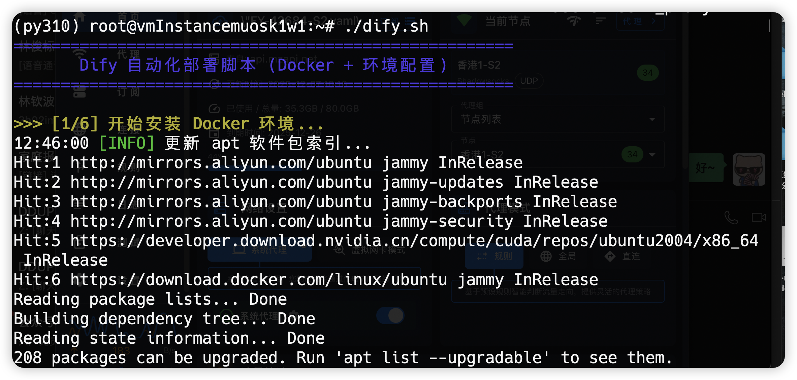
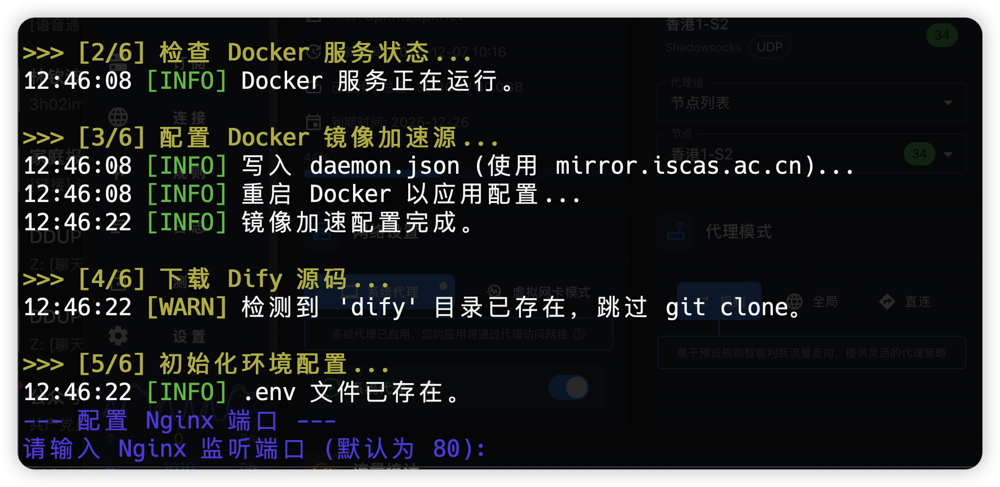
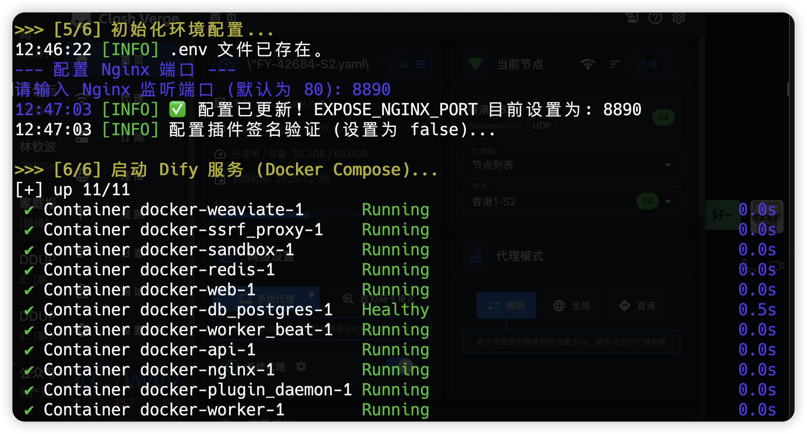
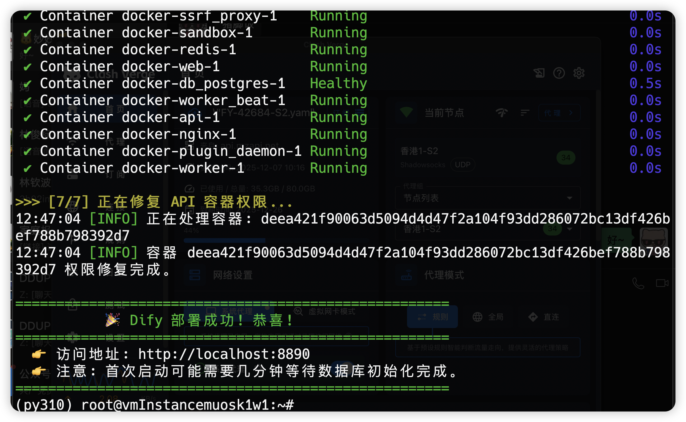

# Dify 自动化部署指南

本指南将介绍如何使用本仓库提供的脚本在 Linux 环境（推荐 Ubuntu）下快速部署 Dify。

## 部署流程图

```mermaid
graph TD
    Start[开始] --> CheckSudo{检查 Root/Sudo 权限}
    CheckSudo -- 否 --> Warn[提示使用 Sudo]
    CheckSudo -- 是 --> InstallDocker[1. 安装 Docker 环境]
    
    subgraph DockerInstallation [Docker 安装]
        InstallDocker --> UpdateApt[更新 apt 索引]
        UpdateApt --> InstallDeps[安装依赖 ca-certificates, curl]
        InstallDeps --> AddGPG[添加 Docker GPG 密钥]
        AddGPG --> AddRepo[添加 Docker 软件源]
        AddRepo --> InstallPkg[安装 docker-ce 等组件]
    end

    InstallPkg --> CheckDocker{2. 检查 Docker 服务}
    CheckDocker -- 未运行 --> StartDocker[启动 Docker]
    StartDocker --> ConfigMirror[3. 配置镜像加速]
    CheckDocker -- 运行中 --> ConfigMirror

    subgraph MirrorConfig [镜像加速配置]
        ConfigMirror --> WriteDaemon[写入 daemon.json (mirror.iscas.ac.cn)]
        WriteDaemon --> ReloadDocker[重启 Docker 服务]
    end

    ReloadDocker --> CloneRepo[4. 下载 Dify 源码]
    CloneRepo --> CheckDir{dify 目录是否存在?}
    CheckDir -- 否 --> GitClone[git clone dify]
    CheckDir -- 是 --> SkipClone[跳过克隆]
    
    GitClone --> EnterDir[进入 dify/docker 目录]
    SkipClone --> EnterDir

    subgraph EnvConfig [环境配置]
        EnterDir --> CheckEnv{检查 .env}
        CheckEnv -- 不存在 --> CopyEnv[复制 .env.example -> .env]
        CheckEnv -- 存在 --> InputPort
        CopyEnv --> InputPort[用户输入 Nginx 端口]
        InputPort --> UpdatePort[更新 EXPOSE_NGINX_PORT]
        UpdatePort --> DisableVerify[禁用插件签名验证]
    end

    DisableVerify --> StartCompose[6. 启动服务 (docker compose up -d)]
    StartCompose --> FixPerms[7. 修复 API 容器权限]
    FixPerms --> Success[输出访问地址]
    Success --> End[结束]
```


## 前置要求

*   Linux 操作系统 (推荐 Ubuntu 20.04+)
*   Root 权限或 Sudo 权限

## 自动部署脚本

`deploy/dify/dify.sh` 脚本负责 Docker 环境的安装和 Dify 服务的部署。

### 使用方法

1.  进入脚本目录：
    ```bash
    cd deploy/dify
    ```

2.  赋予脚本执行权限：
    ```bash
    chmod +x dify.sh
    ```

3.  执行脚本（建议使用 sudo）：
    ```bash
    sudo ./dify.sh
    ```

### 脚本功能

*   **环境检查与配置**：自动检查并配置系统环境。
*   **Docker 安装**：自动安装 Docker 和 Docker Compose。
*   **服务部署**：拉取并启动 Dify 相关服务容器。








## 验证部署

部署完成后，您可以通过浏览器访问服务器 IP 地址来验证 Dify 是否启动成功。
