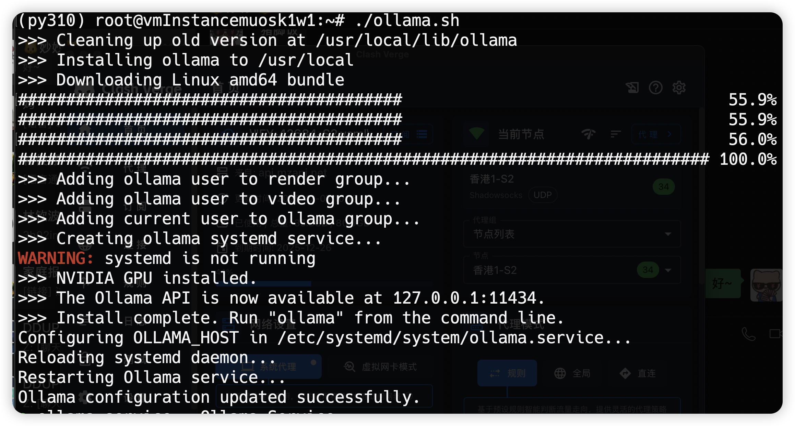
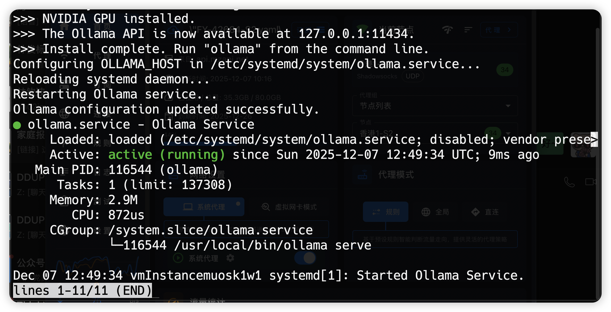

# Ollama 部署指南

Ollama 是一个开源的大模型本地运行工具。本指南介绍如何使用脚本快速部署 Ollama。

## 部署流程图

```mermaid
graph TD
    Start[开始部署] --> InstallOllama[1. 安装 Ollama]
    InstallOllama --> RunInstallScript[执行官方安装脚本 curl | sh]
    
    RunInstallScript --> CheckSystemd{2. 检查 systemctl}
    CheckSystemd -- 存在 --> ConfigureService[配置 Systemd 服务]
    CheckSystemd -- 不存在 --> SkipConfig[跳过配置 (非 Linux Systemd 环境)]

    subgraph ServiceConfiguration [服务配置]
        ConfigureService --> CheckServiceFile{检查 ollama.service 文件}
        CheckServiceFile -- 存在 --> CheckEnv{检查 OLLAMA_HOST}
        CheckServiceFile -- 不存在 --> WarnMissing[警告: 服务文件缺失]
        
        CheckEnv -- 未配置 --> AddEnv[添加 OLLAMA_HOST=0.0.0.0:11434]
        CheckEnv -- 已配置 --> SkipEnv[跳过添加]
        
        AddEnv --> ReloadDaemon[systemctl daemon-reload]
        ReloadDaemon --> RestartService[systemctl restart ollama]
    end

    SkipConfig --> EnsureRunning[3. 确保服务运行]
    RestartService --> EnsureRunning
    SkipEnv --> EnsureRunning
    WarnMissing --> EnsureRunning

    subgraph ServiceStartup [服务启动]
        EnsureRunning --> Status[检查状态]
        Status --> Start[启动服务]
        Start --> Enable[设置开机自启]
    end

    Enable --> Verification[4. 验证与集成]
    Verification --> VerifyVer[验证版本: ollama --version]
    VerifyVer --> RunModel[运行模型: ollama run llama3]
    RunModel --> DifyConfig[Dify 后台配置]
    DifyConfig --> End[集成完成]
```


## 部署脚本

位于 `deploy/ollama/deploy.sh` 的脚本可以帮助您快速安装和启动 Ollama 服务。

### 使用方法

1.  进入脚本目录：
    ```bash
    cd deploy/ollama
    ```

2.  赋予脚本执行权限：
    ```bash
    chmod +x deploy.sh
    ```

3.  执行脚本：
    ```bash
    ./deploy.sh
    ```





## 验证安装

安装完成后，您可以通过以下命令检查 Ollama 版本或运行模型：

```bash
ollama --version
ollama run llama3
```

## 与 Dify 集成

部署完成后，您可以在 Dify 的模型供应商设置中添加 Ollama，填入 Ollama 的服务地址（通常为 `http://host.docker.internal:11434` 或服务器真实 IP:11434）。
