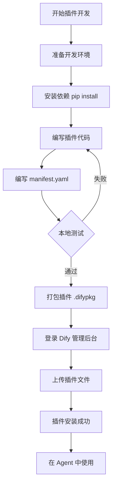
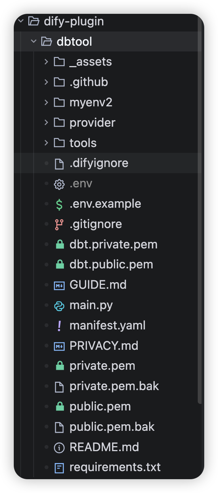
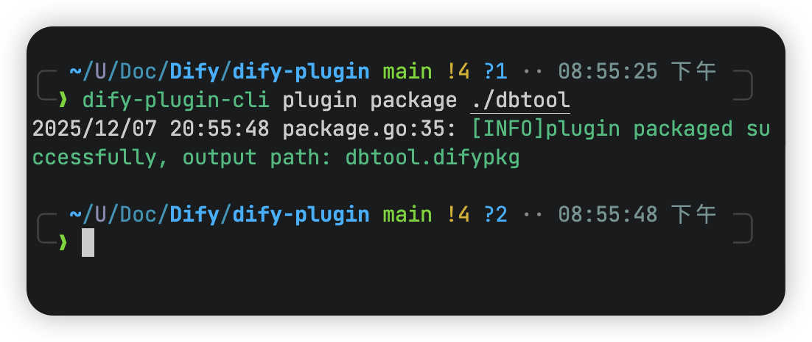
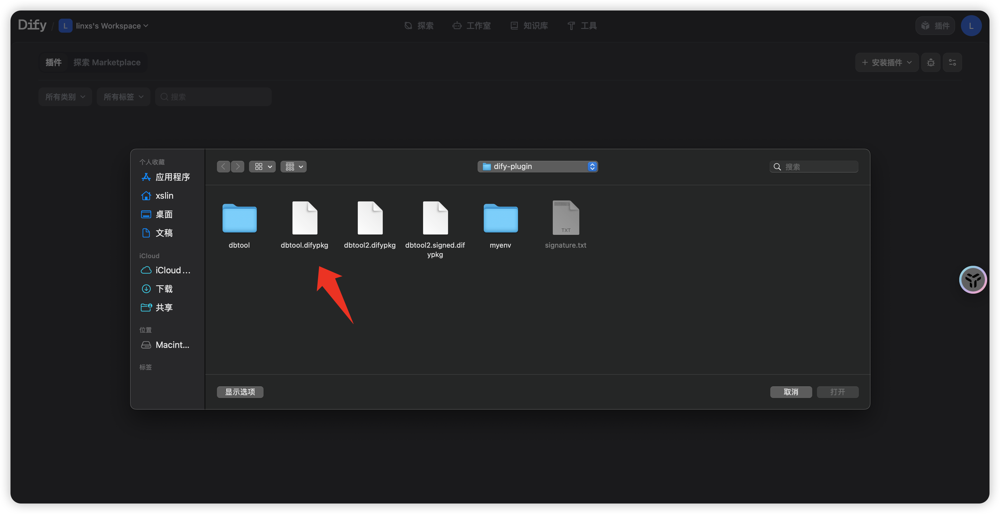
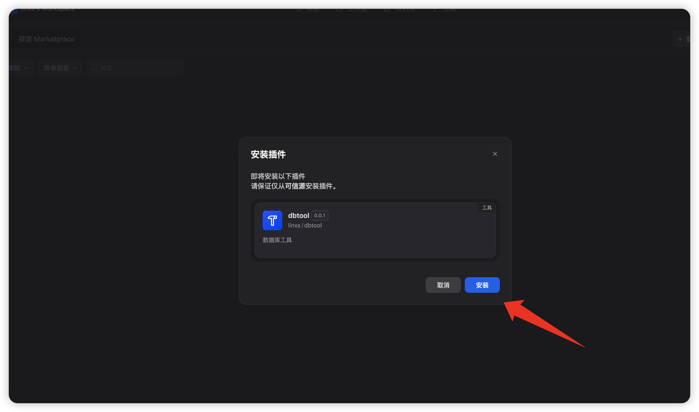
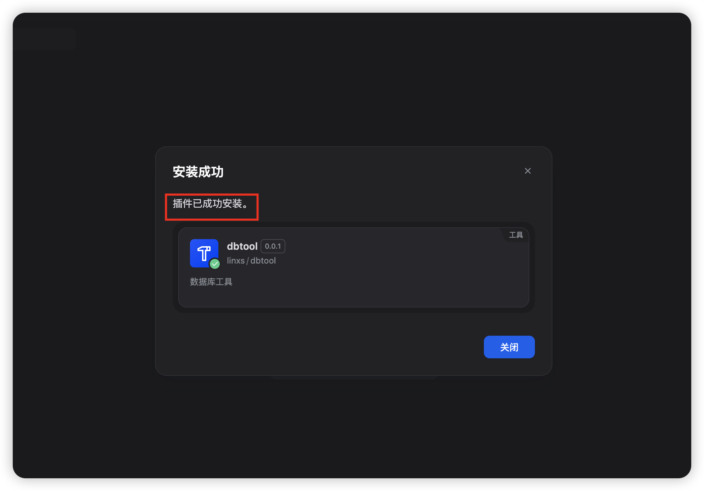
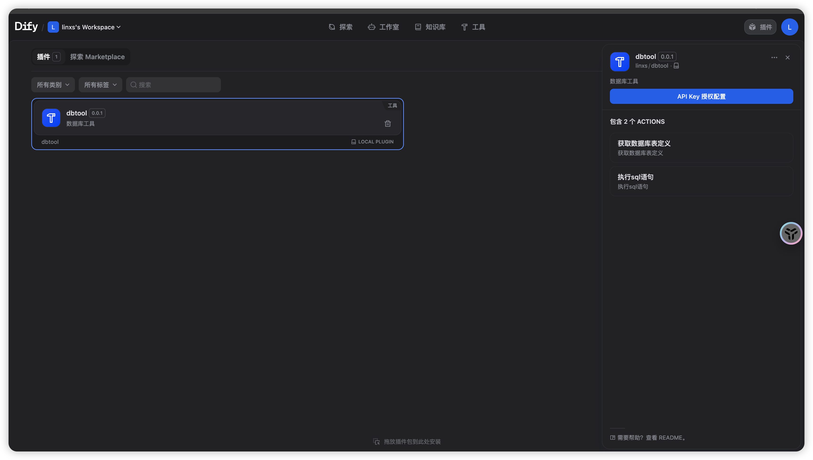

# Dify 插件开发教程

本仓库包含自定义 Dify 插件的源代码，示例位于 `dify-plugin/` 目录下。本教程以 `dbtool` 为例，介绍如何开发和发布插件。

## 开发流程图




## 目录结构

插件代码位于 `dify-plugin/` 目录下。

*   **`dbtool/`**: DBTool 插件的源代码。

## DBTool 插件示例

**DBTool** 是一个实用的 Dify 插件，允许 Agent 直接与数据库进行交互。

### 功能特性

*   **执行 SQL (Execute SQL)**: 对连接的数据库运行 SQL 查询。
*   **获取表定义 (Get Table Definition)**: 获取模式信息和表定义，帮助 LLM 理解数据库结构。



## 开发环境准备

1.  **Python 环境**: 建议使用 Python 3.10+。
2.  **依赖安装**:
    ```bash
    pip install -r dify-plugin/dbtool/requirements.txt
    ```

## 插件打包与安装

1.  **打包插件**:
    使用 Dify 的插件打包工具将插件目录打包为 `.difypkg` 文件。

2.  **上传插件**:
    登录您的 Dify 实例，进入插件管理页面，上传生成的 `.difypkg` 文件。









## 贡献指南

如果您开发了新的插件，欢迎提交 Pull Request 将其添加到 `dify-plugin/` 目录下。
